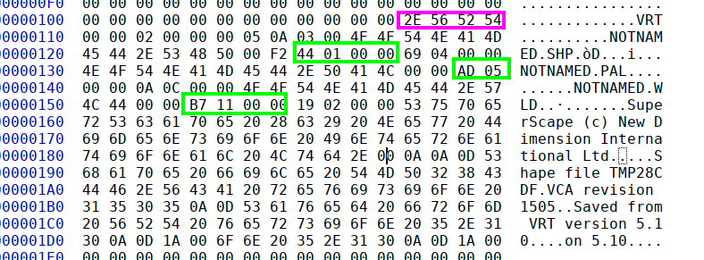
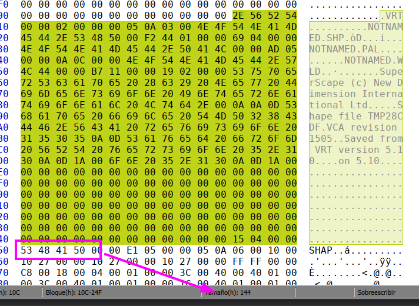
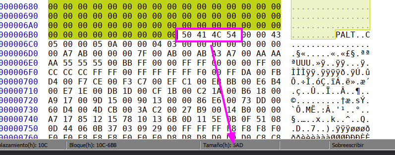
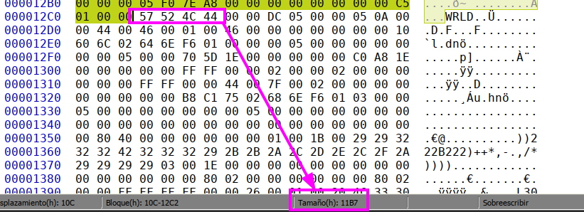
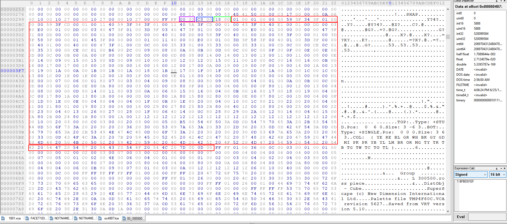
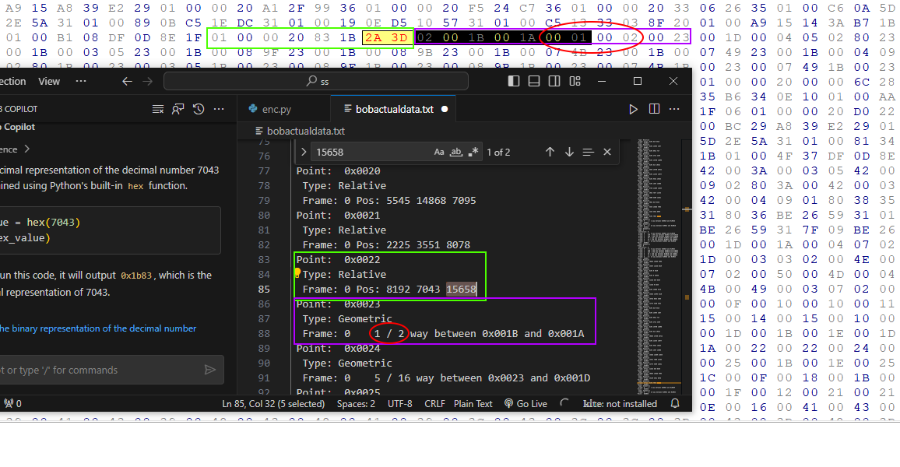
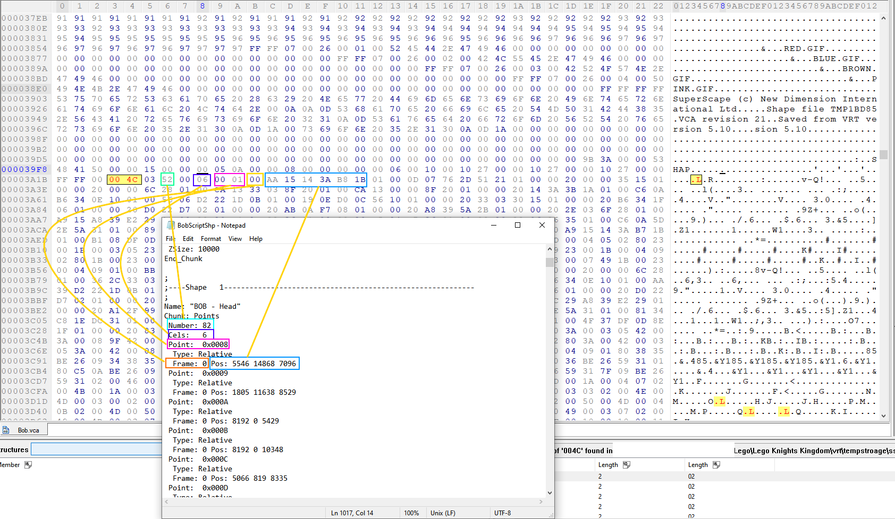
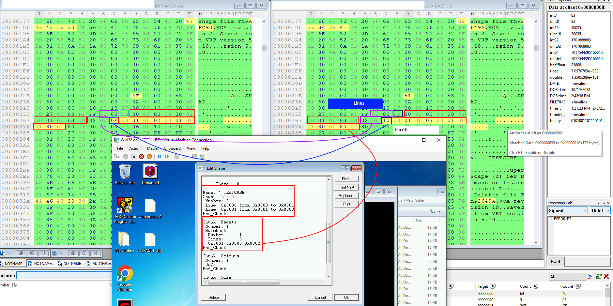

# Overview

This project is to help recreate the old Lego Creator Knight's Kingdom game in a modern framework, with additional game modes. Utilizing web tech such as 3JS + MERN. I believe it is far better and easier to utilize than using local compiled executables with OGL/Unreal/Vulkan/etc. However for extracting the model data, local C-based files would be more ideal.

# Folders

Below you will find the associated folders pertaining to the project and research as to which I have gathered on the subject.

For reverse engineering the model data, [resources](./resources/) is the place to be.

For writing the modern app, [src](./src/) is the place to be.

# [resources](./resources/)

This folder contains the files which I have acquired from original developers at Superscape.

### [Archive](./resources/Archive/)

Contains certain files which were found in older Superscape VRT 5.71, and used to import data.

### [model_files](./resources/model_files/)

Contains sample model file data, with thumbnail, which you can open in any Hex editor to see the finer details.

### [ordinals](./resources/ordinals/)

Python scripts as swell as the MFC42 file which would have been utilized in 2000 to create the game.

### [sdk](./resources/sdk/)

Contains the SDK which was documented and used by Superscape employees, to help them understand what the program does.

### [research](./resources/research/)

Here is the compiled research I, along with help from RE community members, have been able to come up with:

This is what the VRT file name consists of, and will let you know the offsets of the VCA files.

This is the Shape data, which you can see follows along with the offsets.

This is the palette data, which also follows along the offsets.

This is the world data, which follows the offsets.

This is a basic brick, with the shape offset at top

Here is an example of the point data which VRT uses. The data is split by memory address in geometric, or regular. Also can have facets and line data as well.

This is what an example script looks like when pulling from VRT 5.60. They updated a ton of new information and features with 5.71, though the developers I talked to did not have copies as the company was bought twice, now owned by EA.

Here is an example of the modified VCA file. I simply added one new point and you can see the difference the HEX file saves it as.

### [lca_file](./resources/model_files/workshop_slim_00_l307000.lca)

Consists of LCA (24 or 27 bit wrapper over VCA file format containing model data).

The offsets for each subfile such as SHP, PAL, WRLD, etc. are included within this particular file.

# [src](./src/)

Contains the main components which are utilized to recreate and expand upon the game

### [images](./src/images/)

Contains the upscaled images which I extracted from original bitmaps parsed out to better be utilized later on.

### [models](./src/models/)

Is a model that I extracted from Lego Island 2, to help get a basic grasp for dealing with the engine/app to utilize. Was becoming worn down and wanted to have some progress to boost my mental health.

### [components](./src/components/)

Is where the components for each screen will be, to help make workflow of the game easier to utilize. As of now, just recreating with higher definition files, but later on will change things around to be more graphic-oriented like using shaders instead of photos, or real-time rendered scenes. Once the castle data can be extracted will make it into a dynamic not static welcome screen.

~~~~~~~~~~~~~~~~~~~~~~~~~~~~~~~~~~~~~~~~~~~~~~~~~~~~~~~~~~~~~~~~~~~~~~~
~~~~~~~~~~~~~~~~~~~~~~~~~~~~~~~~~~~~~~~~~~~~~~~~~~~~~~~~~~~~~~~~~~~~~~~
# Boilerplate React stuff

~~~~~~~~~~~~~~~~~~~~~~~~~~~~~~~~~~~~~~~~~~~~~~~~~~~~~~~~~~~~~~~~~~~~~~~
~~~~~~~~~~~~~~~~~~~~~~~~~~~~~~~~~~~~~~~~~~~~~~~~~~~~~~~~~~~~~~~~~~~~~~~

# Getting Started with Create React App

This project was bootstrapped with [Create React App](https://github.com/facebook/create-react-app).

## Available Scripts

In the project directory, you can run:

### `npm start`

Runs the app in the development mode.\
Open [http://localhost:3000](http://localhost:3000) to view it in your browser.

The page will reload when you make changes.\
You may also see any lint errors in the console.

### `npm test`

Launches the test runner in the interactive watch mode.\
See the section about [running tests](https://facebook.github.io/create-react-app/docs/running-tests) for more information.

### `npm run build`

Builds the app for production to the `build` folder.\
It correctly bundles React in production mode and optimizes the build for the best performance.

The build is minified and the filenames include the hashes.\
Your app is ready to be deployed!

See the section about [deployment](https://facebook.github.io/create-react-app/docs/deployment) for more information.

### `npm run eject`

**Note: this is a one-way operation. Once you `eject`, you can't go back!**

If you aren't satisfied with the build tool and configuration choices, you can `eject` at any time. This command will remove the single build dependency from your project.

Instead, it will copy all the configuration files and the transitive dependencies (webpack, Babel, ESLint, etc) right into your project so you have full control over them. All of the commands except `eject` will still work, but they will point to the copied scripts so you can tweak them. At this point you're on your own.

You don't have to ever use `eject`. The curated feature set is suitable for small and middle deployments, and you shouldn't feel obligated to use this feature. However we understand that this tool wouldn't be useful if you couldn't customize it when you are ready for it.

## Learn More

You can learn more in the [Create React App documentation](https://facebook.github.io/create-react-app/docs/getting-started).

To learn React, check out the [React documentation](https://reactjs.org/).

### Code Splitting

This section has moved here: [https://facebook.github.io/create-react-app/docs/code-splitting](https://facebook.github.io/create-react-app/docs/code-splitting)

### Analyzing the Bundle Size

This section has moved here: [https://facebook.github.io/create-react-app/docs/analyzing-the-bundle-size](https://facebook.github.io/create-react-app/docs/analyzing-the-bundle-size)

### Making a Progressive Web App

This section has moved here: [https://facebook.github.io/create-react-app/docs/making-a-progressive-web-app](https://facebook.github.io/create-react-app/docs/making-a-progressive-web-app)

### Advanced Configuration

This section has moved here: [https://facebook.github.io/create-react-app/docs/advanced-configuration](https://facebook.github.io/create-react-app/docs/advanced-configuration)

### Deployment

This section has moved here: [https://facebook.github.io/create-react-app/docs/deployment](https://facebook.github.io/create-react-app/docs/deployment)

### `npm run build` fails to minify

This section has moved here: [https://facebook.github.io/create-react-app/docs/troubleshooting#npm-run-build-fails-to-minify](https://facebook.github.io/create-react-app/docs/troubleshooting#npm-run-build-fails-to-minify)
