# Knights Kingdom — Grok Roadmap

Phased cleanup and modernization plan for **`src/` game code only**.  
RE work (`resources/`, `tools/`) is out of scope unless requested.

**Branch:** `grok-dev`  
**Last updated:** 2026-06-30

---

## Guiding Principles

1. **Stack-first organization** — keep `*Stack` folder structure; improve internals.
2. **Incremental phases** — each phase leaves `npm run build` working.
3. **Minimal → Moderate → Ambitious** — prefer small wins before large refactors.
4. **Commit per phase** — commit on `grok-dev` after each completed phase, then **`git push origin grok-dev`** (see `grok/WORKFLOW.md`).

---

## Phase Overview

```mermaid
flowchart LR
    p0[Phase0_Setup]
    p1[Phase1_Cleanup]
    p2[Phase2_SharedUI]
    p3[Phase3_GameUI]
    p4[Phase4_GameState]
    p5[Phase5_GridFix]
    p6[Phase6_NextJS]
    p7[Phase7_LegacyCleanup]
    p8[Phase8_Engine]
    p9[Phase9_Features]
    p10[Phase10_Infra]
    p11[Phase11_Workshop3D]
    p0 --> p1 --> p2 --> p3 --> p4 --> p5 --> p6 --> p7 --> p8 --> p9 --> p10 --> p11
```

| Phase | Status | Focus |
|-------|--------|-------|
| 0 | ✅ Done | `grok-dev` branch setup |
| 1 | ✅ Done | Bugs, dead code, data flow fixes |
| 2 | ✅ Done | Common layout, PaginatedGrid, world data |
| 3 | ✅ Done | Merge MainGame/WorkShop UI trees |
| 4 | ✅ Done | GameContext, serializable saves |
| 5 | ✅ Done | `usePaginatedGrid` stability fix |
| 6 | ✅ Done | Next.js 15 App Router migration |
| 7 | ✅ Done | CRA / react-router legacy removal |
| 8 | ✅ Done | Engine hardening (Core, hydrate, cleanup) |
| 9 | ✅ Done | Snapshot gallery, workshop, dark weather, worlds |
| 10 | ✅ Done | `userService`, code splitting, ESLint |
| 11 | ⬜ Active | Workshop 3D brick editor (see `grok/WORKSHOP_3D.md`) |

### Deferred / user-owned

| Item | Status | Notes |
|------|--------|-------|
| Lego Clock loading modal | ✅ Done | `GameLoadingProvider` + portal modal across `(game)` routes |
| Screenshot menu (SnapShot) | ✅ Done | Restored original CRA grid layout (90px gap, holder frame) |
| Workshop menu (WorkShop) | ✅ Done | `WorkshopStageLayout`, pixel-anchored metrics, holder grid |
| Workshop 3D brick editor | ⬜ Active (D1) | Procedural bricks only — **LCA→GLB abandoned** |
| Save game menu styling (MyModels) | ✅ Done | `wh_selection` frame, holder fit, snapshot thumbnails |
| R3F migration | ⬜ Deferred | Plain Three.js retained; `GameEngineCore` instead |
| Unique GLB per world 2–10 | ⬜ Deferred | All worlds use `map1` placeholder for now |
| Shared worlds playability | ⬜ Deferred | No `filePath` on shared catalog yet |

---

## Phase 0 — Branch Setup ✅

- Created local `grok-dev` from clean `main`
- User works in `D:\CODING\THREEJS\knightskingdom\knightskingdom`
- Grok sandbox at `C:\Users\david\.grok\worktrees\...`

---

## Phase 1 — Minimal Cleanup ✅

**Goal:** Fix bugs and remove dead code without restructuring.

See [CHANGELOG.md](./CHANGELOG.md) for file-level detail. All Phase 1 tasks complete.

---

## Phase 2 — Shared Components ✅

**Goal:** Extract reusable primitives; reduce duplication.

- `BackCheckmarkButton`, `MenuScreenLayout`, `usePaginatedGrid`, `PaginatedGrid`
- World catalog → `src/data/worlds/`
- Screen migrations: Authentication, MainMenu, Options, Credits, Start

---

## Phase 3 — Shared Game UI ✅

**Goal:** ~40% file reduction by merging parallel MainGame/WorkShop trees.

- `MainGameStack/shared/` — `GameShell`, `ComponentTop`, `ComponentBottom`, `Bucket`, `Palette`
- `mode: 'game' | 'workshop'` config via `toolbarConfig/`
- Thin `MainGame.jsx` / `WorkShop.jsx` wrappers

---

## Phase 4 — Game State ✅

**Goal:** Single source of truth; enable real save/load.

- [x] `GameContext` + `useReducer` in `MainGameStack/context/`
- [x] Serializable scene schema (`sceneSchema.js`)
- [x] Canvas capture → `savedWorlds[id].snapshots[]`
- [x] `MyModels` saved-world list UI
- [x] `handleSave` → `saveWorldProgress()` → localStorage
- [x] Options → `selectedProfile.options` persistence

---

## Phase 5 — Grid Stability ✅

**Goal:** Fix pagination infinite-loop bug.

- [x] `usePaginatedGrid` — `useMemo` derived state instead of sync `useEffect`
- [x] `BucketBottom` — stable `arrows` object for hook deps

---

## Phase 6 — Next.js Migration ✅

**Goal:** CRA → Next.js 15 App Router.

- [x] `app/` pages for all routes (`src/lib/routes.js` constants)
- [x] `UserDataProvider` replaces `App.js` class state
- [x] `WorldSessionProvider` for in-game session + navigation
- [x] Auth gate in `app/(game)/layout.jsx`

---

## Phase 7 — Legacy Cleanup ✅

**Goal:** Remove CRA / react-router shells.

- [x] Deleted `App.js`, `index.js`, CRA test files, `*Stack.jsx` routers
- [x] Removed `react-router-dom` dependency
- [x] Added `npm run clean`, `npm run dev:clean`

---

## Phase 8 — Engine Hardening ✅

**Goal:** Maintainable Three.js lifecycle without R3F migration.

### Phase 8a — Save/load hydrate ✅
- [x] `applySavedSceneToThree`, `applyCameraFromState` in `sceneSchema.js`
- [x] `ModelLoader` `restore` case + `setupPlayableGltfScene`
- [x] `hydrationScene` in `GameContext`; hydrate after assets ready in `GameEngine`

### Phase 8b — GameEngineCore ✅
- [x] `GameEngineCore.js` — single rAF loop, `registerFrameCallback`, `mount()` / `dispose()`
- [x] `sceneDispose.js` — dispose utilities, preserved world roots
- [x] `GameEngine.jsx` — thin React wrapper
- [x] `SkyBoxLoader` — removes old skybox before re-add
- [x] `ClimateLoader` — no orphan rAF loops
- [x] `MapLoader` — tags map as `GameMap`

### Phase 8c — Engine cleanup ✅
- [x] `ModelLoader` — shared `configureGltfMeshNodes`, removed ~200 lines dead code
- [x] Canvas-bound pointer events + `getBoundingClientRect` raycasting
- [x] Atmospheric fog + low-lying mist layers (replaced particle fog)

### Bug fixes (post-8b)
- [x] Toolbar toggle-close for paint, drive, climate, music, bucket
- [x] Music `AbortError` from interrupted `play()` promises
- [x] Snow particle animation (scene lookup each frame)
- [x] Start page leave icon stacking / sizing

---

## Phase 9 — Features ✅

**Goal:** Wire remaining game features to real data.

### SnapShot real gallery ✅
- [x] `getWorldSnapshots`, `mergeSnapshotLists`, `removeWorldSnapshot` in `worldSave.js`
- [x] `SnapShotBody` — profile + session captures in paginated grid
- [x] Print / delete actions; preview on selection
- [x] `onRemoveSnapshot` in `WorldSessionProvider`

### Workshop mapData ✅
- [x] `WorkShop` receives `mapData` from `WorldSessionProvider`
- [x] World name label; save/leave returns to same world session
- [x] Workshop background from `WorkShopResourceStack`

### Dark weather modes ✅
- [x] `DARK_SUNNY`, `DARK_WINDY`, `DARK_DRIZZLY`, `DARK_THUNDERSTORM` in `ClimateLoader`
- [x] `DARK_FOGGY` — dark atmospheric + mist layers
- [x] Parameterized rain (drizzle vs thunderstorm intensity)

### Worlds 2–10 ✅
- [x] All local worlds unlocked and playable
- [x] Placeholder: `map1` GLB + grass skybox until unique assets added

---

## Phase 10 — Infrastructure ✅

- [x] `src/services/userService.js` — seed JSON, localStorage, session auth, API POST
- [x] `src/api/index.js` — thin re-export layer over `userService` + `worldSave`
- [x] Lazy game routes via `src/lib/lazyGameScreens.jsx` + `screens/` wrappers
- [x] Main-game First Load JS: ~284 kB → ~107 kB (Three.js deferred)
- [x] `GameEngine.jsx` exhaustive-deps warning resolved
- [x] Removed dead layout CSS from `WorkShop.module.css`

### Deferred
- [ ] Broader ESLint unused-vars sweep
- [ ] Dead CSS audit across all screen `.module.css` files
- [ ] TypeScript migration (optional)

---

## Phase 11 — Workshop 3D Brick Editor ⬜

**Goal:** Build custom LEGO creations in the workshop viewport; save and place them in the main world as grouped models (original game behavior).

**Full plan:** [`grok/WORKSHOP_3D.md`](./WORKSHOP_3D.md)

### Prerequisites ✅
- [x] Workshop UI/layout (`WorkshopStageLayout`, `workshopStageMetrics.js`, holder grid)
- [x] Brick bucket catalog UI (~200 `.lca` + PNGs in `BucketBottomResourceStack/`)
- [x] Main game engine interaction modes (reuse, not rewrite)

### Approach: Option D confirmed — procedural bricks (no LCA pipeline)

**Constraint:** LCA/VCA → GLB conversion failed after ~2 years RE; offsets/meshes unusable. Do **not** plan on extracting game meshes from `.lca` files.

| Sub-phase | Status | Deliverable |
|-----------|--------|-------------|
| D1 | ✅ | `WorkshopEngineCore` + `BrickFactory` + basic tools |
| D2 | ✅ | `workshopSave.js`, `brickInstances[]` save/load + thumbnail |
| D2b | ⬜ **Backlog** | Bucket stay-open; straight camera; finite build bounds; top-bar tools; duplicate-above; brick selector box |
| D3 | ✅ | `brickCatalog.generated.js` — 141 bucket entries → parametric shape recipes (`generate-brick-catalog.mjs`) |
| D4 | ✅ | `customCreations` + workshop screenshot → My Creations main-game bucket tab → `CreationLoader` |
| D5 | ⬜ | Challenges + instructions + optional hand-authored GLBs (optional) |

See [`grok/WORKSHOP_3D.md`](./WORKSHOP_3D.md) for D1 file checklist and data model.

---

## Per-Stack Reference

### AuthenticationStack
- Profile CRUD, max 5 profiles, rank images
- **Fixed:** persistence, selection types, stable IDs
- **Future:** `useProfiles` hook

### MainMenuStack / StartStack
- World picker → `mapData` → MainGameStack via `WorldSessionProvider`
- **Fixed:** selection bugs, worlds 2–10 playable (placeholder map)
- **Future:** unique map GLBs, shared world engine assets

### MainGameStack
- **Fixed:** shared UI, GameContext, engine core, snapshots, workshop context
- **Future:** workshop 3D brick editor + workshop→world model transfer

### GameEngine
- Plain Three.js via `GameEngineCore` (no R3F)
- Single render loop; climate animation via frame callbacks
- **Future:** optional R3F migration if ever needed

---

## What NOT to Touch (Unless Asked)

- `resources/` — RE research, SDK, sample LCA files
- `tools/lca2obj/` — Python LCA parser
- Root `workshop_slim_*.obj` sample outputs