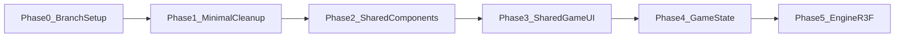

# Knights Kingdom — Grok Roadmap

Phased cleanup and modernization plan for **`src/` game code only**.  
RE work (`resources/`, `tools/`) is out of scope unless requested.

**Branch:** `grok-dev`

---

## Guiding Principles

1. **Stack-first organization** — keep `*Stack` folder structure; improve internals.
2. **Incremental phases** — each phase leaves `npm start` working.
3. **Minimal → Moderate → Ambitious** — prefer small wins before large refactors.
4. **Commit per phase** — commit on `grok-dev` after each completed phase.

---

## Phase Overview



| Phase | Status | Depth | Focus |
|-------|--------|-------|-------|
| 0 | ✅ Done | Setup | `grok-dev` branch |
| 1 | ✅ Done | Minimal | Bugs, dead code, data flow fixes |
| 2 | ✅ Done | Moderate | Common layout, PaginatedGrid, world data |
| 3 | ✅ Done | Moderate | Merge MainGame/WorkShop UI trees |
| 4 | ✅ Done | Moderate | GameContext, serializable saves |
| 5 | ⬜ Next | Ambitious | React Three Fiber migration |
| 6 | ⬜ Planned | Infrastructure | API service, bundle splitting |

---

## Phase 0 — Branch Setup ✅

- Created local `grok-dev` from clean `main`
- User works in `D:\CODING\THREEJS\knightskingdom\knightskingdom`
- Grok sandbox at `C:\Users\david\.grok\worktrees\...`

---

## Phase 1 — Minimal Cleanup ✅

**Goal:** Fix bugs and remove dead code without restructuring.

### Cross-cutting
| Task | Status |
|------|--------|
| Fix `App.js` `./Components/` import casing | ✅ |
| `persistUserData` + localStorage | ✅ |
| Delete `src/api/api.js` | ✅ |
| Remove unused App imports | ✅ |

### AuthenticationStack (priority)
| Task | Status |
|------|--------|
| Profile object selection (not string) | ✅ |
| Wire `updateUserData` on mutations | ✅ |
| Break circular import | ✅ |
| Stable IDs + default options | ✅ |
| Empty name guard | ✅ |

**Deferred options:**
- B: Lift profile state to App
- C: `useProfiles` hook
- D: Split into ProfileList / ProfileCard

### MainMenuStack
| Task | Status |
|------|--------|
| Delete `PlayerSelect/` stub | ✅ |
| Remove dead `/change-player`, `/quit` routes | ✅ |
| Trim Credits comments | ✅ |

**Deferred:** MenuScreenLayout, unified navigation, Options persistence

### StartStack / World
| Task | Status |
|------|--------|
| Clear selection on tab switch | ✅ |
| Guard checkmark | ✅ |
| Fix World 10 duplicate | ✅ |
| `key={item.id}` | ✅ |

**Deferred:** WorldBody JSX dedup (done in P2), world catalog extract (done in P2)

### MainGameStack
| Task | Status |
|------|--------|
| Workshop navigation passes worldData | ✅ |
| Snapshot passes sceneSnapshot | ✅ |
| SkyBox climate type fix | ✅ |
| `Modes` enum usage | ✅ |
| MyModels TODO / barrel removal | ✅ |

**Deferred:** Merge UI trees, GameContext, R3F

---

## Phase 2 — Shared Components ✅

**Goal:** Extract reusable primitives; reduce duplication without merging game/workshop yet.

### Common layer
| Task | Status |
|------|--------|
| `BackCheckmarkButton` | ✅ |
| `MenuScreenLayout` | ✅ |
| `usePaginatedGrid` hook | ✅ |
| `PaginatedGrid` component | ✅ |

### Screen migrations
| Screen | Status |
|--------|--------|
| Authentication | ✅ |
| MainMenu | ✅ |
| Options | ✅ |
| Credits | ✅ |
| Start | ✅ |

### PaginatedGrid adopters
| Component | Status |
|-----------|--------|
| WorldBody (deduped local/shared) | ✅ |
| MainGame BucketBottom | ✅ |
| WorkShop BucketBottom | ✅ |
| SnapShotBody | ✅ |

### World data
| Task | Status |
|------|--------|
| `src/data/worlds/engineAssets.js` | ✅ |
| `src/data/worlds/localWorlds.js` | ✅ |
| `src/data/worlds/sharedWorlds.js` | ✅ |
| Slim `WorldBodyResourceStack` (themes only) | ✅ |

---

## Phase 3 — Shared Game UI ✅

**Goal:** ~40% file reduction by merging parallel MainGame/WorkShop trees.

### Target structure
```
MainGameStack/
  shared/
    GameShell/           ← layout CSS (game vs workshop heights)
    ComponentTop/        ← mode: 'game' | 'workshop'
    ComponentBottom/
    Bucket/
      BucketBottom.jsx   ← dataSource: models | bricks
    Palette/             ← variant + optional onColorSelect
    BottomIconComponent/
    TopIconComponent/
    Ball/
    toolbarConfig/       ← imports from existing *ResourceStack barrels
```

### Tasks
- [x] Create `MainGameStack/shared/` folder
- [x] `ComponentTop` with icon config per mode
- [x] `ComponentBottom` with icon config per mode
- [x] `Bucket` + `BucketBottom` with `dataSource` prop
- [x] `Palette` unified (game 14 colors + hex, workshop 22 visual)
- [x] Thin `MainGame.jsx` / `WorkShop.jsx` wrappers via `GameShell`
- [x] Keep separate `*ResourceStack` barrels; config in `toolbarConfig/`
- [x] Thin re-exports in old `MainGame/` and `WorkShop/` component paths

### MainGame vs WorkShop differences to preserve

| Feature | MainGame | WorkShop |
|---------|----------|----------|
| GameEngine | Yes | No |
| ComponentTop tools | 6 + play + drive | 5 brick tools |
| ComponentBottom | hammer, camera, climate, music | sweep only |
| Bucket data | models/vehicles/scenery | brick categories |
| Palette | 14 colors → GameEngine | 22 colors visual only |

---

## Phase 4 — Game State ✅

**Goal:** Single source of truth; enable real save/load.

- [x] `GameContext` + `useReducer` in `MainGameStack/context/`
- [x] Replace 20+ `useState` in `MainGame.jsx` (now thin shell via `useGameContext`)
- [x] Serializable scene schema in `context/sceneSchema.js`
- [x] SnapShot: `renderer.domElement.toDataURL()` → profile `savedWorlds[id].snapshots[]`
- [x] `MyModels` minimal list UI (saved worlds from profile)
- [x] Wire `handleSave` → `saveWorldProgress()` → localStorage via App
- [x] Options → `selectedProfile.options` persistence (controlled `OptionsMenuPlaceholder`)

---

## Phase 5 — Engine Modernization ⬜

**Goal:** Maintainable 3D layer.

| Current | Target |
|---------|--------|
| Raw THREE in useEffect | `@react-three/fiber` + `drei` |
| Imperative loaders | `useGLTF`, React scene tree |
| Window event listeners | R3F pointer events |
| Multiple rAF loops | Single render loop |

### Suggested structure
```
GameEngine/
  GameCanvas.jsx
  hooks/useGameMode.js
  hooks/useScenePersistence.js
  systems/ClimateSystem.jsx
  systems/MapScene.jsx
  systems/ModelInstance.jsx
```

### Open engine bugs to fix during migration
- `modelsLoaded` ref blocks reload on mapData change
- SkyBox re-added on climate change without removing old mesh
- ModelLoader `Vector3.copy` bug in add case
- ClimateLoader windy `setCurrentSystem` not called

---

## Phase 6 — Infrastructure ⬜

- [ ] `src/services/userService.js`
- [ ] Optional `server/` + CRA proxy for dev API
- [ ] Code splitting / lazy routes for 3.2 MB bundle
- [ ] Single `Router` in App (`/authentication/*`, `/main-menu/*`)
- [ ] TypeScript migration (optional)
- [ ] Remove dead CSS in screen `.module.css` files (post-MenuScreenLayout)

---

## Per-Stack Reference (Original Analysis)

### AuthenticationStack
- Profile CRUD, max 5 profiles, rank images (page/knight/baronet)
- **Fixed:** persistence, selection types
- **Future:** `useProfiles` hook, lift state to App

### MainMenuStack
- Thin router: MainMenu, Options, Credits, StartStack
- **Fixed:** dead routes, PlayerSelect
- **Future:** Options persistence, unified nav callbacks

### StartStack / World
- World picker → `mapData` → MainGameStack
- Only World 1 has full engine assets
- **Fixed:** selection bugs, data extract
- **Future:** worlds 2–10 assets, shared world playability

### MainGameStack
- Largest stack; MainGame vs WorkShop duplication
- **Fixed:** data pipes, SkyBox, Modes
- **Future:** Phase 3 merge, Phase 4 state, Phase 5 R3F

### Common
- **Added:** BackCheckmarkButton, MenuScreenLayout, PaginatedGrid
- **Future:** consolidate checkmark PNG copies across ResourceStacks

---

## What NOT to Touch (Unless Asked)

- `resources/` — RE research, SDK, sample LCA files
- `tools/lca2obj/` — Python LCA parser
- Root `workshop_slim_*.obj` sample outputs
- `package.json` major upgrades (CRA eject, etc.)