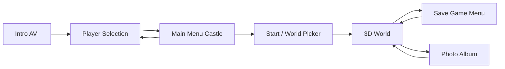
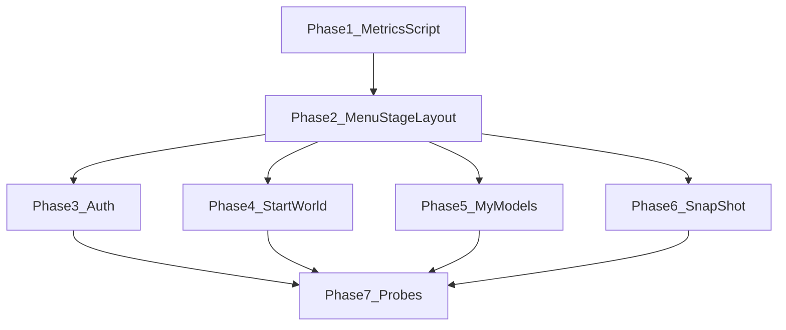

# Knights Kingdom — Menu Styling Fix Plan

**Branch:** `grok-dev-vanilla` (Grok-only styling work)  
**Scope:** Authentication, Start/World picker, Save game (MyModels), Photo album (SnapShot)  
**Out of scope:** All 3D engine code (`GameEngine*`, `WorkshopEngine*`, loaders, `sceneSchema`, climate, drive mode, etc.)

**Last updated:** 2026-07-05

---

## 1. Original Game — Mechanics & Styling Reference

LEGO Creator: Knight's Kingdom (2000, Superscape VRT) is a **fixed 800×600** bitmap-UI building game. Every menu screen is a full-frame background image with **pixel-anchored** interactive regions — not responsive CSS percentages.

### Screen flow (styling-relevant)



### Universal UI conventions (all four target screens)

| Convention | Original behavior |
|------------|-------------------|
| Canvas | **800×600** logical pixels, letterboxed on modern displays |
| Background | Single full-frame PNG/BMP; `background-size: contain` on black letterbox |
| Confirm | **Checkmark** button, bottom-left (~15% from left edge of frame) |
| Cancel / back | Context-specific: trash (auth), leave icon (start), checkmark returns (save/photo) |
| Typography | Bitmap font on parchment — cream `#FFFFC6`, ~24px Arial is the modern approximation |
| Selection | Frame overlay PNG (`selected.png` / `wh_selection.png`) centered on 109×80 thumbnail cells |
| Grids | **3×3** paginated cells; scroll arrows above/below grid column |
| Help | Animated knight help bubble, bottom-right of holder panel |
| Hover | Two-frame sprite swap (`*_2.png` idle, `*_4.png` hover) via `CommonComponent` / `IconComponent` |

### Screen-specific reference

#### A. Player Selection (Authentication / "Change Player")

| Element | Original layout |
|---------|-----------------|
| Background | Parchment scroll centered on stone/table motif |
| Profile list | **Vertical column** on the scroll (right half of parchment), not viewport-centered |
| Slots | Up to **5** profiles + empty "new player" slot |
| Rank icons | Page / Knight / Baronet shield sprites beside name |
| New player | Blinking caret in name field; **"Enter name here"** banner above scroll |
| Selected state | Rank icon swaps to `*_4.png` highlight frame |
| Actions | Checkmark (confirm) bottom-left; trashcan (delete selected) bottom-right |

**Rank progression (mechanic, affects icons):** Page → Knight → Baronet (earned through challenges; all new profiles start as Page).

#### B. Start Menu / World Picker

| Element | Original layout |
|---------|-----------------|
| Background | Castle vista (`StartResourceStack/background.png`) |
| Holder | `light_drop_down.png` / `dark_drop_down.png` — 519×530 panel |
| Tabs | **Local Worlds** / **Shared Worlds** header strip (141×57 each); active tab uses `*_4.png`, inactive `*_2.png` |
| Grid | 3×3 world thumbnails (109×80), 9 per page |
| Locked worlds | Greyed/disabled overlay on shared worlds |
| Shared tab footer | Save, Load, Copy, Trash icon row (online features — cosmetic in remake) |
| Leave | Animated door icon, **top-right** (~13% from right) |
| Confirm | Checkmark bottom-left (disabled until unlocked world selected) |

#### C. Save Game Menu (My Models)

| Element | Original layout |
|---------|-----------------|
| Background | In-game parchment frame (`MyModelsResourceStack/background.png`) |
| Holder | `drop_down.png` — **519×587** (taller than world picker; grid starts lower) |
| Grid | 3×3 save-slot thumbnails from world captures |
| Selection | `wh_selection.png` frame (95×67 scaled to cell) |
| Footer | Copy + Delete icons inside holder |
| Empty slots | Transparent/blank plate placeholder |
| Confirm | Checkmark returns to game (does not load — load is in-game save icon) |

#### D. Photo Album (SnapShot)

| Element | Original layout |
|---------|-----------------|
| Background | Yellow/parchment photo frame (`SnapShotResourceStack/background.png`) |
| Holder | `snapshot_holder.png` — **516×541** inner frame |
| Grid | 3×3 captured screenshots (same 109×80 cell geometry) |
| Selection | `selected.png` frame overlay (same as world picker) |
| Footer | **Print**, **Destroy** (clear all), **Delete** (single) icons |
| No preview pane | Screenshots appear **only** in grid cells (confirmed 2026-06-28 changelog) |
| Confirm | Checkmark returns to game |

---

## 2. Cross-Validation — What You Have vs Original

### Infrastructure already correct ✅

| Asset | Status | Notes |
|-------|--------|-------|
| `MenuScreenLayout` | ✅ Good base | Full-viewport background + corner slots |
| `HolderGridLayout` + `holderGridMetrics.js` | ✅ Strong | Pixel anchors for World, SnapShot, MyModels grids |
| `PaginatedGrid` + `usePaginatedGrid` | ✅ Good | Stable pagination, arrow themes |
| `BackCheckmarkButton` | ✅ Exists | Used on Auth + Start; missing on SnapShot/MyModels |
| `CommonComponent` / `IconComponent` | ✅ Good | Two-frame hover pattern matches original |
| Background PNGs | ✅ Present | Per-screen `*ResourceStack/background.png` |
| Cell geometry | ✅ 109×80 | Matches measured original slots |

### Gaps and regressions ❌

| Screen | Issue | Severity |
|--------|-------|----------|
| **All four** | No **800×600 stage scaler** — menus use raw `100vw/100vh` + `%` positioning; breaks on non-4:3 viewports | 🔴 Critical |
| **Authentication** | `ProfileInput` / `profileDiv` use `position: fixed; left: 52%` — anchors to viewport, not parchment | 🔴 Critical |
| **Authentication** | `align-items: relative` in CSS (invalid) | 🟡 Bug |
| **Authentication** | Profiles in flex column with `padding: 20px` — not aligned to scroll art | 🔴 Critical |
| **Authentication** | `enterNameImage` at `top: 10%` viewport — should be scroll-relative | 🟠 Major |
| **Start / World** | `WorldHeader` always shows `*_2.png` — **no active tab state** (`*_4.png`) | 🟠 Major |
| **Start / World** | `World.componentHolder` (660×587) has no centering transform on 800×600 stage | 🟠 Major |
| **SnapShot** | `SnapShotHolder` missing `left/top/transform` — holder floats at (0,0) vs background frame | 🔴 Critical |
| **SnapShot / MyModels** | Don't use `MenuScreenLayout` / `BackCheckmarkButton` — duplicated corner CSS | 🟡 Inconsistency |
| **MyModels** | Holder uses `translateX(-52%)` magic number — fragile vs measured stage offset | 🟠 Major |
| **MainMenu** | Debug `<h1>Welcome, {name}!</h1>` — not in original (out of scope but remove if passing through) | 🟢 Minor |
| **Corner buttons** | `bottom: 10px; left: 15%` in multiple files — should be stage-relative pixels | 🟠 Major |
| **Metrics tooling** | `analyze-workshop-images.mjs` covers workshop only — no probes for auth/start/save/photo backgrounds | 🟠 Major |

### Partially fixed (verify visually) 🔄

Per `grok/CHANGELOG.md` (2026-06-28 session), SnapShot grid and MyModels overlays were restored from CRA extracts. Code now uses `HolderGridLayout` metrics, but **without a unified 800×600 stage wrapper the fixes may still drift on wide monitors**.

---

## 3. Fix Strategy — The "Menu Stage" Pattern

Workshop already solved this with `WorkshopStageLayout` + `workshopStageMetrics.js`. **Replicate that pattern for bitmap menus** without touching 3D code.

### Phase 0 — Branch & asset policy ✅

- [x] Branch `grok-dev-vanilla` created from `grok-dev`
- [x] Media extensions added to `.gitignore`
- [ ] Optional: `git rm --cached` bulk untrack if repo slimming desired (destructive — ask first)

### Phase 1 — Measurement tooling (no UI changes yet)

**Goal:** Authoritative pixel map for each background PNG.

| Task | File | Action |
|------|------|--------|
| 1.1 | `grok/analyze-menu-images.mjs` | **New** — scan auth, start, mymodels, snapshot backgrounds; detect holder panel rects, corner button zones, profile column |
| 1.2 | `src/Components/Common/MenuStageLayout/menuStageMetrics.js` | **New** — export `MENU_CANVAS = {800,600}` + per-screen holder/corner anchors |
| 1.3 | `testing/menu-layout.probe.mjs` | **New** — Puppeteer screenshot at 1920×1080 + 800×600; assert holder centering |

**Deliverable:** `menuStageMetrics.js` with measured constants replacing magic `%` values.

### Phase 2 — Shared `MenuStageLayout` component

**Goal:** One scaler for all bitmap menus (mirror workshop).

| Task | File | Action |
|------|------|--------|
| 2.1 | `src/Components/Common/MenuStageLayout/MenuStageLayout.jsx` | **New** — 800×600 `.stage` centered via `transform: scale(min(vw/800, vh/600))` |
| 2.2 | `MenuStageLayout.module.css` | **New** — black letterbox, `overflow: hidden` |
| 2.3 | `src/Components/Common/index.js` | Export `MenuStageLayout` |
| 2.4 | Refactor `MenuScreenLayout` | Nest content inside `MenuStageLayout` OR merge — background becomes child of stage |

**CSS variable contract:**

```css
.menuStage {
  width: 800px;
  height: 600px;
  position: relative;
  /* per-screen vars from menuStageMetrics */
  --menu-checkmark: 120px 560px;   /* example — measure in Phase 1 */
  --menu-trash: 680px 560px;
}
```

### Phase 3 — Authentication styling

**Files only:**

- `Authentication.jsx` / `.module.css`
- `ProfileContainer.jsx` / `.module.css`
- `ProfileInput.jsx` / `.module.css`
- `ProfileIcon.jsx` / `.module.css`
- `AuthStackResources/*` (no edits — layout only)

| Task | Detail |
|------|--------|
| 3.1 | Wrap content in `MenuStageLayout` with `AUTH_METRICS` |
| 3.2 | Replace all `position: fixed` + `%` with stage-absolute px coords |
| 3.3 | Profile column: single vertical stack at measured `x,y` with fixed `line-height` per slot (~70px) |
| 3.4 | Fix `align-items: center` (remove invalid `relative`) |
| 3.5 | `enterNameImage` anchored to scroll top-center |
| 3.6 | Corner buttons via `MenuScreenLayout` slots fed stage-relative positions |
| 3.7 | Remove `alert()` — use `GeneralDialogueComponent` or disabled checkmark (original never used browser alerts) |

**Acceptance:** At 1920×1080 and 1280×720, profile names stay on parchment; checkmark/trash align with background art.

### Phase 4 — Start / World picker styling

**Files only:**

- `Start.jsx` / `.module.css`
- `World.jsx` / `.module.css`
- `WorldHeader.jsx` / `.module.css`
- `WorldBody.jsx` / `.module.css` (grid metrics only — no data changes)

| Task | Detail |
|------|--------|
| 4.1 | `Start` → `MenuStageLayout` wrapper |
| 4.2 | `World.componentHolder` positioned at measured center offset on stage |
| 4.3 | **Active tab sprites** — pass `isLocalWorlds` to `WorldHeader`; swap `local_worlds_2/4`, `shared_worlds_2/4` |
| 4.4 | Leave icon: move from inline `Start` child to `MenuScreenLayout.topRight` slot with stage coords |
| 4.5 | Validate `HOLDER_VARIANTS.WORLD_LIGHT/DARK` against remeasured `light_drop_down.png` / `dark_drop_down.png` |
| 4.6 | Disable checkmark visually when no world selected (original greys out) |

**Acceptance:** Tab highlight matches active panel; world grid cells align with purple/yellow slots; leave icon sits in castle door hotspot.

### Phase 5 — Save game (MyModels) styling

**Files only:**

- `MyModels.jsx` / `.module.css`
- `MyModelsHolder.jsx` / `.module.css`
- `MyModelsBody.jsx` / `.module.css`
- `MyModelsResourceStack/index.js` (overlay asset refs only)

| Task | Detail |
|------|--------|
| 5.1 | Migrate to `MenuStageLayout` + `BackCheckmarkButton` (remove duplicate `CommonComponent` corner) |
| 5.2 | Replace `translateX(-52%)` with measured `left` from `menuStageMetrics.MY_MODELS.holder` |
| 5.3 | Re-verify `HOLDER_VARIANTS.MY_MODELS` gridTop (113) against `drop_down.png` scan |
| 5.4 | Confirm `wh_selection.png` frame dimensions match cell (95×67 scaled → 109×80) |
| 5.5 | Empty-state message positioned inside holder, not floating on background |
| 5.6 | Footer copy/delete icons aligned to measured footer rect |

**Acceptance:** Save slots line up with holder cells; selection frame matches workshop bucket cells; checkmark matches other screens.

### Phase 6 — Photo album (SnapShot) styling

**Files only:**

- `SnapShot.jsx` / `.module.css`
- `SnapShotHolder.jsx` / `.module.css`
- `SnapShotBody.jsx` / `.module.css`

| Task | Detail |
|------|--------|
| 6.1 | **Fix holder positioning** — add `left/top/transform` matching background frame opening (mirror MyModels pattern) |
| 6.2 | Migrate to `MenuStageLayout` + `BackCheckmarkButton` |
| 6.3 | Re-verify `HOLDER_VARIANTS.SNAPSHOT` against `snapshot_holder.png` |
| 6.4 | Wire **Destroy** button `onClick` (currently missing handler — icon renders but does nothing) |
| 6.5 | Ensure print/delete/footer icons match measured `footer` rect (gap: 37px) |
| 6.6 | Confirm no preview pane regressed back in |

**Acceptance:** Holder sits inside yellow frame; 3×3 screenshots centered in cells; footer icons clickable and aligned.

### Phase 7 — Visual regression & docs

| Task | Detail |
|------|--------|
| 7.1 | `testing/menu-auth.probe.mjs` | Screenshot auth at 800×600 |
| 7.2 | `testing/menu-start.probe.mjs` | World picker both tabs |
| 7.3 | `testing/menu-mymodels.probe.mjs` | Save menu with fixture saves |
| 7.4 | `testing/menu-snapshot.probe.mjs` | Photo menu with fixture captures |
| 7.5 | Update `grok/CHANGELOG.md` | Document styling phase |
| 7.6 | Update `grok/README.md` backlog | Mark styling plan as active |

---

## 4. Implementation Order (PR-sized chunks)



| PR | Scope | Est. files | Risk |
|----|-------|------------|------|
| PR-1 | `MenuStageLayout` + `menuStageMetrics.js` + analyze script | ~6 new | Low — additive |
| PR-2 | Authentication restyle | ~8 | Medium — UX critical path |
| PR-3 | Start/World header + positioning | ~10 | Medium |
| PR-4 | MyModels holder alignment | ~6 | Low |
| PR-5 | SnapShot holder + destroy handler | ~6 | Low |
| PR-6 | Probe tests + doc updates | ~5 | Low |

**Each PR must:** `npm run build` passes; no edits under `GameEngine/`, `WorkshopEngine/`, `Loaders/`, `sceneSchema.js`.

---

## 5. Files Explicitly Off-Limits (Claude / 3D engine)

```
src/Components/.../MainGame/GameEngine/**
src/Components/.../WorkShop/WorkshopEngine/**
src/Components/.../Loaders/**
src/Components/.../context/sceneSchema.js
src/Components/.../context/gameReducer.js
src/data/worlds/engineAssets.js
public/models/**
resources/model_pipeline/**
```

---

## 6. Quick Wins (can ship before Phase 2)

1. Remove MainMenu debug `<h1>Welcome…</h1>` (1 line)
2. Fix `align-items: relative` → `center` in `ProfileContainer.module.css`
3. Add `SnapShotHolder` absolute positioning (copy MyModels pattern as interim fix)
4. Wire `WorldHeader` active tab sprites (state already exists in `World.jsx`)
5. Wire SnapShot **Destroy** icon handler (stub → `onClearAllSnapshots`)

---

## 7. Success Criteria

| Screen | Done when |
|--------|-----------|
| Authentication | Names/icons track parchment at all aspect ratios; corners align with art |
| Start/World | Active tab highlighted; grid cells match holder slots; leave icon positioned |
| MyModels | `wh_selection` frame centers on thumbnails; holder centered on background |
| SnapShot | Holder inside photo frame; grid-only captures; all footer icons work |
| All | `node grok/analyze-menu-images.mjs` reports ≤2px drift on all anchors |

---

*This plan is styling-only. Game logic, 3D rendering, save schema, and world data are unchanged.*