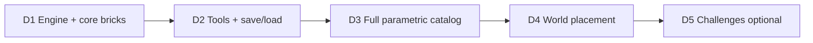

# Workshop 3D Brick Editor — Plan & Session Handoff

**Branch:** `grok-dev`  
**Last updated:** 2026-06-30  
**Status:** **D2 implemented** (2026-06-30) — D3 catalog expansion next  
**Prior work:** Workshop UI/layout ✅ complete (`WorkshopStageLayout`, `workshopStageMetrics.js`, `HolderGridLayout`)

---

## Quick Start for a New Session

Tell Grok:

> Read `grok/README.md`, `grok/WORKSHOP_3D.md`, and `grok/ROADMAP.md` Phase 11. On `grok-dev`. Workshop UI done. **User chose Option D.** LCA→GLB is abandoned — use procedural/parametric bricks only. Implement Phase D1. Push to `origin/grok-dev` after every commit.

---

## ⚠️ Critical Constraint — LCA → GLB Is Out of Scope

**User decision (2026-06-30):** After ~2 years of RE work, LCA/VCA → GLB/OBJ conversion **does not produce usable meshes**. Offset parsing is unreliable; output is consistently wrong.

| Approach | Status |
|----------|--------|
| `tools/lca2obj/lca2obj.py` | ❌ Not viable for game assets |
| `resources/convert_brick.py` | ❌ Not viable for game assets |
| Batch `.lca` → `.glb` pipeline | ❌ **Removed from plan** |
| `.lca` files in `BucketBottomResourceStack/` | ✅ Keep for RE reference + UI thumbnails only |
| PNG bucket thumbnails | ✅ Keep — UI already uses these |

**Do not block workshop implementation on mesh extraction.** Build the editor with **procedural/parametric Three.js geometry** keyed to catalog entries. Optional: hand-authored GLBs added one-at-a-time later (not a pipeline).

---

## User Choices (confirmed)

| Decision | Choice |
|----------|--------|
| Implementation option | **Option D** (phased hybrid) |
| Brick meshes | **Procedural/parametric** — not LCA-derived |
| World transfer | Single grouped placement in main world (original game behavior) |
| Camera | Fixed isometric-style (match original workshop viewport) — *default unless user says otherwise* |
| Persistence | Per-profile `customCreations[]` — *default unless user says otherwise* |
| Challenges | Defer to D5 |

---

## Original Game — What the Workshop Did

| Feature | Original behavior | Our approach |
|---------|-------------------|--------------|
| Separate 3D viewport | Black panel on workshop background | `WorkshopEngine` in `.stage` |
| Brick library (9 tabs) | Medieval part categories | Same UI; 3D = parametric shapes per catalog ID |
| Tools | Place, move, rotate, paint, delete, duplicate, sweep | Reuse `GameEngine` interaction patterns |
| Stud snapping | Grid-aligned placement | 0.8 stud unit snap (LEGO: 1 stud = 8mm → use 0.8 world units) |
| Save & transfer | Grouped model → main world bucket | **Runtime Group from `brickInstances[]` JSON** — no GLB required |
| Building instructions | Optional | Defer (D5) |

---

## Revised Option D — Phased Plan (no LCA pipeline)



| Phase | Goal | Deliverable | Effort |
|-------|------|-------------|--------|
| **D1** | Playable workshop | `WorkshopEngineCore`, build plate, ~12 core parametric bricks, place/move/rotate/delete/sweep, bucket selection wired | Small |
| **D2** | Polish + persistence | ✅ `workshopSave.js`, save/load `brickInstances[]` on `savedWorlds[id].workshopDraft` | Medium |
| **D3** | Full bucket catalog (3D) | `brickCatalog.js` — map every bucket entry to parametric shape + stud footprint; approximate slopes/cylinders/arches | Medium–Large |
| **D4** | Main world integration | Export creation → `customCreations[]` → "My Creations" in game bucket → place as runtime `Group` in world | Medium |
| **D5** | Optional extras | Challenge builds, building instructions, hand-curated GLBs for hero parts | Large / optional |

Each phase must pass `npm run build`.

---

## Backlog (user-reported, post-D1)

| Priority | Issue | Notes |
|----------|-------|-------|
| High | **Bucket closes on brick select** | `handleBrickSelect` sets `TOGGLE_BUCKET false` — keep bucket open while placing (original game behavior) |
| High | **Fixed straight camera** | Match main game: fixed camera facing straight at build area, not current diagonal isometric `(14, 11, 14)` |
| Medium | **Finite build bounds vs full viewport** | Viewport/canvas can span full width; actual **model/build plate** for save-to-world should be a **finite stud region** (define export bounds separate from visual plate) |

---

## Brick Asset Strategy (replaces LCA→GLB)

### Primary: Parametric `BrickFactory`

One factory builds Three.js meshes from a **shape recipe** + **stud dimensions**:

```js
// Example catalog entry (NOT from LCA geometry)
{
  id: 'l300500',           // from filename 00_l300500
  name: 'Brick 2×4',
  category: 'basic',
  shape: 'BOX',            // BOX | PLATE | SLOPE | CYLINDER | ARCH | WEDGE approx
  studs: { w: 2, d: 4 },   // stud footprint
  heightPlates: 3,         // 1 brick = 3 plates; 1 plate = 0.8/3 units
  thumbnail: '...png',     // existing UI asset
}
```

**Stud constants:**
- `STUD = 0.8` world units (width/depth per stud)
- Plate height = `STUD / 3`
- Brick height = `STUD` (3 plates)
- Snap grid = `STUD` on X/Z; Y snaps to plate increments

**Shape approximations for D3** (good enough for gameplay; refine visually against PNG thumbnails):

| Category | Parametric shape |
|----------|------------------|
| Basic / slim | `BoxGeometry` from stud footprint × height |
| Plates / tiles | Thin box (1 plate height) |
| Wedges / slopes | `BoxGeometry` + shear or pre-defined slope angles (45°, 33°) |
| Cylindrical | `CylinderGeometry` with stud-aligned radius |
| Arches | `ExtrudeGeometry` or composite boxes |
| Castle / windows | Composite of boxes (frame + hole via CSG or multi-mesh) |

### Secondary (optional, post-D3): Manual GLBs

- Author individual parts in Blender using bucket PNG as reference
- Drop into `public/bricks/<id>.glb`
- Catalog entry: `shape: 'GLB', glbPath: '...'`
- **Never depend on this for MVP**

### What we keep from RE assets

| Asset | Use |
|-------|-----|
| `.lca` files | RE archive only; do not parse at runtime |
| PNG thumbnails | Bucket UI (unchanged) |
| `l<number>` in filenames | Catalog ID → map to public LEGO part dimensions (Rebrickable/LDraw reference for stud size, not mesh) |

---

## Data Model

### Workshop scene (in memory + saved)

```json
{
  "id": "creation-uuid",
  "name": "My Castle Gate",
  "brickInstances": [
    {
      "brickId": "l300500",
      "position": { "x": 0, "y": 0, "z": 0 },
      "rotation": { "x": 0, "y": 0, "z": 0 },
      "color": "c91a09"
    }
  ],
  "thumbnail": "data:image/png;base64,...",
  "updatedAt": "2026-06-30T..."
}
```

### Profile extension

```json
{
  "customCreations": {
    "creation-uuid": { /* scene above */ }
  }
}
```

### World placement (D4)

- User picks creation from game bucket → `ModelLoader` builds a `THREE.Group` from `brickInstances[]` via `BrickFactory`
- Group tagged `isModel`, `isMovable`, `userData.creationId`
- Serialized in world `scene.models[]` as one entry referencing `creationId` (or inlined brick list)

**No GLB export required** for save/load or world placement.

---

## Target Architecture

```
WorkShop.jsx
  └── WorkshopProvider (WorkshopContext)
        ├── GameShell (existing UI)
        ├── WorkshopEngine.jsx
        │     └── WorkshopEngineCore.js   ← flat plate, fixed camera, no map/climate
        │     └── BrickFactory.js         ← parametric mesh from brickCatalog
        │     └── useWorkshopInteraction  ← extracted from GameEngine mouse logic
        ├── Bucket → onBrickSelect(brickId) → mode ADDING
        └── ComponentTop/Bottom → tool handlers

MainGame (D4):
  Bucket "My Creations" tab
    → handleLoadModel('CREATION_<id>')
    → BrickFactory.buildGroup(customCreations[id])
    → place in world scene
```

---

## Phase D1 — Implementation Checklist (START HERE)

### Create

| File | Purpose |
|------|---------|
| `WorkShop/WorkshopEngine/WorkshopEngineCore.js` | Fork `GameEngineCore`: build plate, fixed isometric camera, single rAF loop |
| `WorkShop/WorkshopEngine/WorkshopEngine.jsx` | Mount in viewport; pointer events; mode-driven interaction |
| `WorkShop/WorkshopEngine/BrickFactory.js` | `createBrick(brickId, color)` from catalog recipe |
| `WorkShop/WorkshopEngine/brickCatalog.js` | **Starter set ~12 bricks** (2×4, 2×2, 1×1, 2×3 plate, 1×2 plate, etc.) |
| `WorkShop/WorkshopEngine/studGrid.js` | `snapToStud(position)`, `STUD` constant |
| `WorkShop/context/WorkshopContext.jsx` | Mode state, selected brick, color, handlers |
| `WorkShop/context/workshopReducer.js` | Actions: SET_MODE, SELECT_BRICK, SET_COLOR, etc. |

### Modify

| File | Change |
|------|--------|
| `WorkShop.jsx` | Wrap in `WorkshopProvider`; mount `WorkshopEngine` in `.stage` |
| `shared/Bucket/Bucket.jsx` | Workshop: `onBrickSelect(brickId)` not `SelectedModel` |
| `shared/ComponentTop/ComponentTop.jsx` | Wire workshop move/rotate/delete/duplicate to context |
| `shared/ComponentBottom/ComponentBottom.jsx` | Sweep → clear all `brickInstances` from scene |
| `screens/WorkshopScreen.jsx` | Pass profile if needed for D2 prep |

### D1 acceptance criteria

- [x] Black viewport renders build plate + placed bricks
- [x] Select brick from bucket → click plate → brick appears snapped
- [x] Move, rotate 90°, delete, duplicate, sweep work
- [x] Paint via palette (bonus — planned for D2, shipped early)
- [x] Leave returns to main game (save persistence → D2)
- [x] `npm run build` passes

### D1 files shipped

| Path | Role |
|------|------|
| `WorkShop/WorkshopEngine/WorkshopEngineCore.js` | Build plate, lighting, brick CRUD |
| `WorkShop/WorkshopEngine/WorkshopEngine.jsx` | Pointer tools + canvas mount |
| `WorkShop/WorkshopEngine/BrickFactory.js` | Parametric bricks + optional GLB loader |
| `WorkShop/WorkshopEngine/brickCatalog.js` | Starter 13 recipes + `extractBrickId()` |
| `WorkShop/WorkshopEngine/studGrid.js` | Stud snap constants |
| `WorkShop/context/WorkshopContext.jsx` | Tool state + handlers |
| `WorkShop/WorkShop.jsx` | Wires engine + toolbar + bucket |
| `public/workshop/bricks/` | Drop zone for hand-authored GLB overrides |

---

## Phase D2 — Tools + Persistence

- Paint tool + palette color → `BrickFactory` material update
- Duplicate → clone selected instance offset 1 stud
- Save workshop → `customCreations[id]` on profile via `persistUserData`
- Load workshop → restore `brickInstances[]` on re-enter
- Auto-thumbnail via `renderer.domElement` capture (like snapshot)

---

## Phase D3 — Map Full Bucket UI to Parametric Catalog

- Parse `BucketBottomResourceStack/index.js` entries → generate `brickCatalog.js` entries
- Use `l<number>` filename + category folder to pick shape recipe
- Cross-check proportions against PNG thumbnails (visual QA, not LCA geometry)
- Categories: basic, slim, wedge, cylindrical, arches, castle_components, windows_doors_fences, castle_accessories, tiles, challenges
- **~200 catalog entries** — many share the same shape recipe with different stud sizes

---

## Phase D4 — Main World Placement

- Add `customCreations` to profile schema + `worldSave.js` helpers
- Game bucket: new tab or section "My Creations" with thumbnails
- `ModelLoader` or `CreationLoader`: `buildGroupFromCreation(creation)` → placeable group
- Extend `sceneSchema` to serialize/deserialize creation references in world saves
- Workshop save button → persist creation + navigate to main game with creation available

---

## Phase D5 — Optional

- Challenge brick tutorials (predefined `brickInstances` targets)
- Building instructions viewer
- Hand-authored GLBs for select hero parts (manual, not pipeline)

---

## Current Codebase Gaps (unchanged)

| Gap | Addressed in |
|-----|--------------|
| No engine in workshop viewport | D1 |
| Bucket not wired to 3D | D1 |
| No brick meshes | D1 (`BrickFactory`) |
| Save does nothing | D2/D4 |
| No world transfer | D4 |
| `sceneSchema` lacks creations | D2/D4 |

---

## Open Decisions (minor — defaults set)

| # | Question | Default | Override? |
|---|----------|---------|-----------|
| 1 | Camera | Fixed isometric | User can request orbit/zoom |
| 2 | Persistence | Per-profile `customCreations[]` | Could scope per-world instead |
| 3 | Creation limit | TBD (suggest max 20 per profile) | Set in D2 |

---

## RE Assets — Read-Only Reference

Do not invest further Grok sessions in LCA parsing unless user explicitly requests RE-only work.

| Path | Role |
|------|------|
| `tools/lca2obj/` | RE experiment (broken for production) |
| `resources/convert_brick.py` | RE experiment (broken for production) |
| `resources/research/` | Format documentation |
| `BucketBottomResourceStack/*.lca` | Archive + UI companion to PNGs |

---

## Session History

| Date | Event |
|------|-------|
| 2026-06-30 | Workshop UI ✅. Researched original game. Option D recommended. |
| 2026-06-30 | **User confirmed Option D.** LCA→GLB abandoned. Plan revised. |
| 2026-06-30 | **D1 shipped:** WorkshopEngine, BrickFactory, WorkshopContext, toolbar wired. |
| 2026-06-30 | **Backlog added:** bucket stay-open, straight camera, finite build bounds. |
| 2026-06-30 | **D2 shipped:** `workshopSave.js`, hydrate on enter, save on save/leave + thumbnail. **Next: D3** catalog + backlog fixes. |

---

## Related Docs

| File | Contents |
|------|----------|
| [README.md](./README.md) | Project overview, current status |
| [ROADMAP.md](./ROADMAP.md) | Phase 11 summary |
| [ARCHITECTURE.md](./ARCHITECTURE.md) | Workshop vs main game architecture |
| [CHANGELOG.md](./CHANGELOG.md) | File-level change log |